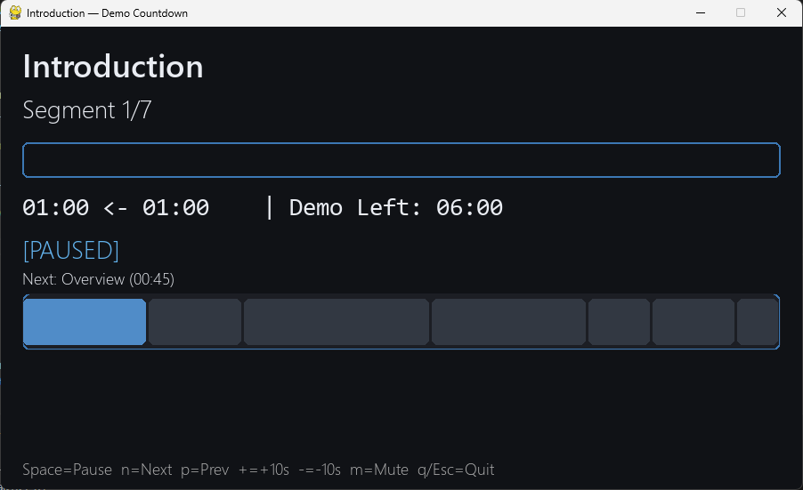

# Demo Countdown Timer

A simple, cross‑platform terminal countdown timer for demos and talks. Step through named segments, see a progress bar and remaining time, and control the flow with quick hotkeys.




## Features

- Multi-segment countdown with names and durations
- Shows remaining time and total for the segment
- Live "Demo Left" total across all remaining segments
- Hotkeys: pause/resume, next/prev, +/- 10s, mute beep, quit
- CLI works on Windows, macOS, and Linux (standard library only)
- Optional GUI for Windows using pygame
 - External segment configuration via `segments.txt`

## Usage (CLI)

1. Ensure you have Python 3.8+ installed.
2. Clone this repo and run the script:

```powershell
python .\main.py
```

3. While the terminal window is focused, use hotkeys:

- Space: Pause/Resume
- n: Next segment
- p: Previous segment (restarts that segment)
- +: Add 10s to current segment
- -: Subtract 10s from current segment (floors at 5s)
- m: Mute/unmute beep
- q: Quit

## Usage (GUI on Windows)

1. Install pygame if needed:

```powershell
pip install pygame
```

2. Run the GUI:

```powershell
python .\main-gui.py
```

3. Hotkeys (window focused):

- Space: Pause/Resume
- n: Next segment
- p: Previous segment (restarts that segment)
- + or Numpad +: Add 10s to current segment
- - or Numpad -: Subtract 10s from current segment (floors at 5s)
- m: Mute/unmute beep
- q or Esc: Quit

## Configure segments

Edit `segments.txt` in this folder. You can use simple CSV with an optional header. Duration can be seconds, `mm:ss`, or `hh:mm:ss`:

```python
name,duration
Introduction,60
Overview,45
Feature Demonstration,1:30
Technical Details,01:15
Q&A Session,30s
Summary,0:40
Closing Remarks,20
```

Notes:
- Lines starting with `#` are ignored (comments).
- Header row is optional; if present, use columns `name` and `duration`.
- Duration accepts seconds (e.g., `90`), `mm:ss` (e.g., `1:30`), or `hh:mm:ss` (e.g., `0:01:15`).
- If `segments.txt` is missing or empty, sensible defaults are used.

## Output

```
Demo Timer — total planned time: 06:00
Press any listed hotkey while this window is focused.

Segment 1/7: Introduction
Controls: Space=Pause/Resume  n=Next  p=Prev  +=+10s  -=-10s  m=Mute  q=Quit
[##############################]  00:00 <- 01:00 [COMPLETED] | Demo Left: 05:00
✅ Segment complete.

Segment 2/7: Overview
Controls: Space=Pause/Resume  n=Next  p=Prev  +=+10s  -=-10s  m=Mute  q=Quit
[########----------------------]  00:32 <- 00:45 [RUNNING] | Demo Left: 04:48
```

## Notes

- CLI mode uses ANSI escape sequences for in-place updates. Windows Terminal and VS Code terminal fully support this. On very old terminals, it will still work but updates may not be as smooth.
- The beep uses `winsound` on Windows and the terminal bell elsewhere (CLI). In GUI mode, beep uses `winsound` on Windows only.
- GUI mode requires `pygame`.
- If `+`/`-` don’t seem to work in the GUI, ensure the window is focused. On some keyboard layouts, use the numpad `+`/`-` keys.

## Contributing

Issues and pull requests are welcome. Please keep the standard library dependency and cross-platform support.

## License

MIT — see `LICENSE`.
