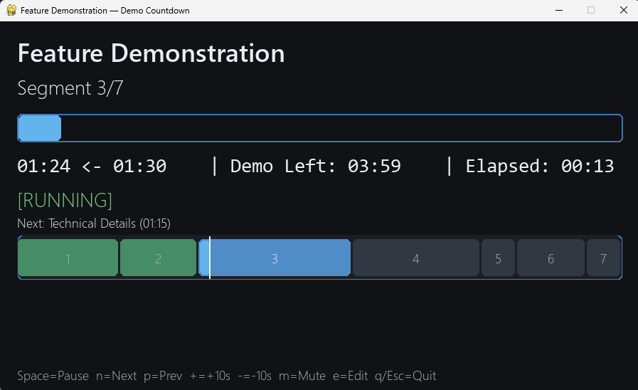

# Demo Countdown Timer

A friendly, cross‑platform countdown timer for demos and talks. Step through named segments, see remaining and total time, visualize the whole plan on a timeline, and tweak segments on the fly with an in‑app editor.




## Features

- Multi-segment countdown with names and durations
- Remaining and total for the current segment, plus live "Demo Left" for the rest
- GUI timeline of all segments with auto-fit and smooth centering on “now”
- Visible marker for current position; segment index labels on the timeline
- Start paused; window title shows the current segment
- Summary screen at the end (planned vs elapsed, delta)
- In‑app Editor (Excel‑style): navigate cells, press Enter to edit, Enter to commit
- Editor supports Name and Duration; Duration accepts `mm:ss` or `hh:mm:ss`
- Save from the editor writes `segments.txt` and reloads it immediately
- Hotkeys: pause/resume, next/prev, +/- 10s, mute beep, edit, quit
- CLI works on Windows, macOS, and Linux (standard library only)
- Optional GUI for Windows using pygame
- External segment configuration via `segments.txt`

## Usage (CLI)

1. Ensure you have Python 3.8+ installed.
2. Clone this repo and run the script:

```powershell
python .\main.py
```

3. While the terminal window is focused, use hotkeys:

- Space: Pause/Resume
- n: Next segment
- p: Previous segment (restarts that segment)
- +: Add 10s to current segment
- -: Subtract 10s from current segment (floors at 5s)
- m: Mute/unmute beep
- q: Quit

## Usage (GUI on Windows)

1. Install pygame if needed:

```powershell
pip install pygame
```

2. Run the GUI:

```powershell
python .\main-gui.py
```

3. Hotkeys (window focused):

- Space: Pause/Resume
- n: Next segment
- p: Previous segment (restarts that segment)
- + or Numpad +: Add 10s to current segment
- - or Numpad -: Subtract 10s from current segment (floors at 5s)
- m: Mute/unmute beep
- e: Open/close the in‑app editor
- q or Esc: Quit (Esc exits the editor first)

### In‑app editor (Excel‑style)

- Arrows Up/Down: move rows
- Left/Right: switch between Name and Duration columns (when not editing)
- Enter/F2: start editing the selected cell; Enter commits
- While editing: Left/Right/Home/End move the caret; Backspace/Delete edit text
- While editing: Up/Down commits and moves to previous/next row; Tab commits and moves to the next cell
- Esc (while editing): cancel edit; Esc/E (when not editing): close the editor

Notes:
- Duration edit pre-fills as `mm:ss` or `hh:mm:ss` and is parsed back on commit
- Press S in the editor to save; the app reloads `segments.txt` immediately

## Configure segments

Edit `segments.txt` in this folder. You can use simple CSV with an optional header. Duration can be seconds, `mm:ss`, or `hh:mm:ss`:

```python
name,duration
Introduction,60
Overview,45
Feature Demonstration,1:30
Technical Details,01:15
Q&A Session,30s
Summary,0:40
Closing Remarks,20
```

Notes:
- Lines starting with `#` are ignored (comments).
- Header row is optional; if present, use columns `name` and `duration`.
- Duration accepts seconds (e.g., `90`), `mm:ss` (e.g., `1:30`), or `hh:mm:ss` (e.g., `0:01:15`).
- If `segments.txt` is missing or empty, sensible defaults are used.

## Output

```
Demo Timer — total planned time: 06:00
Press any listed hotkey while this window is focused.

Segment 1/7: Introduction
Controls: Space=Pause/Resume  n=Next  p=Prev  +=+10s  -=-10s  m=Mute  q=Quit
[##############################]  00:00 <- 01:00 [COMPLETED] | Demo Left: 05:00
✅ Segment complete.

Segment 2/7: Overview
Controls: Space=Pause/Resume  n=Next  p=Prev  +=+10s  -=-10s  m=Mute  q=Quit
[########----------------------]  00:32 <- 00:45 [RUNNING] | Demo Left: 04:48
```

## Notes

- CLI mode uses ANSI escape sequences for in-place updates. Windows Terminal and VS Code terminal fully support this. On very old terminals, it will still work but updates may not be as smooth.
- The beep uses `winsound` on Windows and the terminal bell elsewhere (CLI). In GUI mode, beep uses `winsound` on Windows only.
- GUI mode requires `pygame`.
- If `+`/`-` don’t seem to work in the GUI, ensure the window is focused. On some keyboard layouts, use the numpad `+`/`-` keys.

## Development setup and building a Windows .exe

Set up a local virtual environment (Windows PowerShell):

```powershell
python -m venv .venv
.\.venv\Scripts\Activate.ps1
python -m pip install --upgrade pip
pip install -r requirements.txt
```

Build a standalone GUI .exe with PyInstaller:

```powershell
pip install pyinstaller
pyinstaller --noconsole --onefile --name demo-countdown-gui .\main-gui.py
```

The executable will be in `dist\demo-countdown-gui.exe`.

Using segments.txt with the .exe:
- Lookup order: current working directory → folder next to the `.exe` → embedded data (`_MEIPASS`) → source folder
- Place `segments.txt` next to the `.exe` (recommended), or in the current working directory
- You can also embed a default via `--add-data`: `--add-data "segments.txt;."`

Tip: If you edit and save from the in‑app editor, the file is written and then reloaded immediately so the GUI and timings update at once.

## Contributing

Issues and pull requests are welcome. Please keep the standard library dependency and cross-platform support.

## License

MIT — see `LICENSE`.
